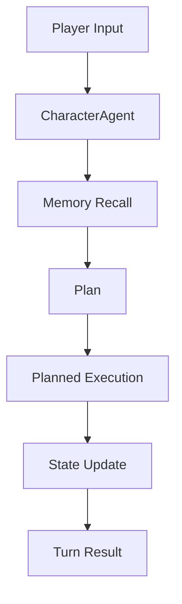
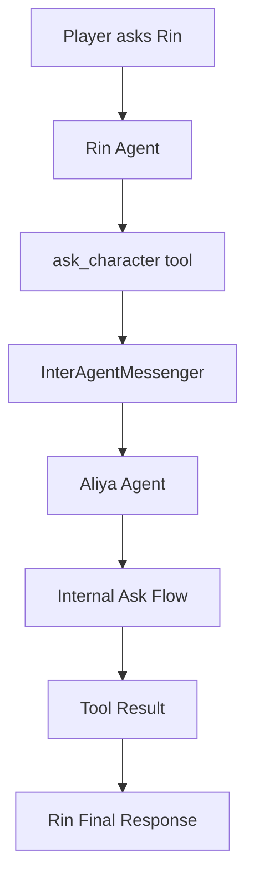
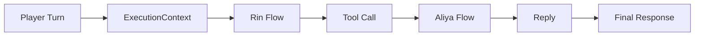

# AI 角色引擎 Agent 实现方案

## 1. 目标与范围

本文档描述一个面向角色陪伴与互动体验的 Agent 技术方案，重点讨论 `Agent`、`Executor`、`LLM`、`Memory`、运行时调度与多角色协作之间的关系。  
目标不是实现一个单轮聊天机器人，而是建立一个可持续扩展的角色运行底座，使角色能够：

- 基于人设、世界观、场景和记忆进行稳定回复
- 在需要时调用工具、询问其他角色、更新状态
- 在复杂回合中执行局部计划，而不是只做一次问答
- 在多角色、多子流程、多工具场景下保持可控与可观测

本文档只讨论技术方案与核心思想，不涉及代码实现细节。

## 2. 总体设计原则

### 2.1 分层清晰

系统应明确分为五层：

1. 宿主层：CLI / TUI / GUI / 游戏宿主
2. Agent 运行时层：消息、调度、flow、角色回合
3. Executor 推理层：结构化计划、工具决策、回复生成、状态结算
4. Memory / State 层：长期记忆、短期上下文、角色状态
5. LLM 适配层：模型请求、结构化输出解析、路由

### 2.2 复杂性下沉

复杂性不应堆在单个 `CharacterAgent` 类中，而应下沉到：

- Flow：管理阶段与流程结构
- Planned Execution：管理局部计划
- Executor：管理单步结构化推理
- Runtime：管理消息、超时、协作

### 2.3 副作用受控

角色对白、工具调用、状态变更必须解耦：

- 角色不能先宣告副作用成功，再补执行
- 工具结果必须先返回，再进入最终角色回复
- 状态更新只能由专门阶段结算

## 3. 核心模块关系

### 3.1 模块职责

#### Agent

负责一轮角色回合的组织与执行，重点是：

- 接收消息
- 构造角色上下文
- 选择运行 flow
- 驱动节点执行
- 汇总最终 `turn result`

#### Executor

负责调用 LLM 做结构化推理，不直接拥有角色运行时。它更像一组专用推理器，例如：

- Plan Executor
- Tool Use Executor
- Character Response Executor
- State Update Executor
- Planned Execution Plan Executor
- Flow Routing Executor

#### LLM

负责模型调用本身，包括：

- 模型路由
- prompt 发送
- 结构化 JSON 输出
- 超时、中断与错误处理

LLM 不知道角色运行时，不应直接承载业务流程。

#### Memory

负责提供角色可用的记忆素材，包括：

- 长期记忆摘要
- 相关片段检索
- 会话内上下文
- 必要的事实回灌

Memory 是 Agent 的输入来源之一，不是 Agent 的执行器。

## 4. 一轮标准角色回合

当前建议把标准角色回合抽象成一条内建 flow：

```text
memoryRecall -> plan -> plannedExecution -> stateUpdate -> done
```

含义如下：

- `memoryRecall`：加载与本轮问题相关的长期记忆和上下文
- `plan`：判断本轮是直接回答、调用工具、询问他角，还是拒绝/澄清
- `plannedExecution`：执行局部步骤计划
- `stateUpdate`：根据本轮互动结果产出状态变化建议
- `done`：结束并返回结果

### 4.1 标准回合流程图



## 5. Planned Execution：局部计划执行器

### 5.1 为什么需要它

单次角色回合往往不是“直接回复”这么简单。常见情况包括：

- 先确认动作，再调用工具，再汇报结果
- 先问另一位角色，再整合答复
- 工具调用失败后转入降级回复

因此，`plannedExecution` 应视为一个复合执行节点，而不是普通单步节点。

### 5.2 它的职责

`plannedExecution` 需要完成两件事：

1. 生成一个局部步骤计划
2. 按计划逐步执行

典型局部步骤为：

```text
pre_action_response -> tool_use -> final_response
```

更一般化后，它应支持：

- 最少 1 步，最多有限步
- 工具步骤局部 loop
- 每一步带目标和约束信息

### 5.3 设计意义

这一层把“回合级 flow”和“LLM 单步推理”之间隔开，形成中层控制面。  
没有这层，角色一旦需要复杂动作，逻辑就会重新回流到 `CharacterAgent` 中。

## 6. Executor 体系设计

Executor 不应是一个万能对话器，而是一组职责明确的专用推理器。

### 6.1 建议的核心 Executor

- `PlanExecutor`
  生成本轮计划，决定是否需要工具或内部协作。
- `PlannedExecutionPlanExecutor`
  把 plan 转成局部 step list。
- `ToolUseExecutor`
  判断调用哪个工具、传什么参数、何时停止。
- `CharacterResponseExecutor`
  生成角色可见文本。
- `StateUpdateExecutor`
  产出结构化状态变化建议。
- `FlowRoutingExecutor`
  在多条合法边中做语义选择。

### 6.2 核心思想

Executor 只负责“某一步该怎么想”，不负责“整轮该怎么跑”。  
整轮运行是 Agent / Flow 的职责。

## 7. 多角色协作模型

### 7.1 基本原则

角色 A 询问角色 B，不能直接调用 B 的底层 LLM。  
必须走统一 runtime，使 B 仍然作为一个完整 Agent 被调度。

### 7.2 角色间询问流程



### 7.3 轻量内部咨询 Flow

角色间对话不应强制走完整玩家回合。  
建议单独定义轻量内部 flow：

```text
memoryRecall -> plan -> plannedExecution -> finalize -> done
```

它与标准 chat flow 的区别是：

- 保留记忆、计划和角色回复能力
- 跳过面向玩家的完整状态结算
- 更快返回内部咨询结果

## 8. Memory 与 State 的角色

### 8.1 Memory

Memory 的目标不是“把所有历史都塞给模型”，而是提供经过筛选的角色事实背景：

- 角色长期记忆
- 共享记忆
- 场景相关片段
- 上一轮局部事实

它应服务于三类步骤：

- plan
- final response
- state update

### 8.2 State

状态建议与记忆不同。  
状态更偏向“本轮互动造成的变化”，例如：

- affection
- trust
- mood
- relationship flags

State Update 阶段只输出结构化变化建议，不直接在 LLM 中偷偷完成落地。

## 9. 统一执行上下文与超时管理

### 9.1 为什么不能层层各自超时

多角色、多工具、多子图调用下，如果每一层都自己维护超时，会出现：

- 上层先超时，下层其实还在正常推进
- 同一轮调用语义不一致
- 递归越深越难诊断

### 9.2 建议方案

引入统一的 `ExecutionContext`，在一轮对话中贯穿全链路，管理：

- 整体超时
- 子步骤 idle 超时
- 最近进度时间
- 进度原因

核心语义是：

- 总超时限制整轮生命周期
- idle 超时判断是否“失联”
- 只要节点持续有进度，就刷新 idle 计时

### 9.3 执行上下文流程图



这保证了复杂协作链共享同一套时间语义。

## 10. 可扩展方向

### 10.1 Subgraph

当某类局部行为逐渐复杂时，不应继续堆在单个节点里，而应允许节点调用子图。  
这适合承载：

- 多步任务执行
- 多轮角色内工作流
- 可复用的剧情动作模板

### 10.2 多模态与 GUI

未来扩展到 GUI、语音、Live2D、多模态时，Agent 层不应重写。  
宿主变化应主要影响：

- 输入输出适配
- 可见块展示
- 能力层扩展

Agent 核心结构仍应保持稳定。

## 11. 结论

本方案的核心思想不是“做一个更聪明的聊天 prompt”，而是构建一个分层明确、复杂性可下沉、协作可扩展的角色运行时：

- Agent 负责回合组织
- Flow 负责阶段结构
- Planned Execution 负责局部计划
- Executor 负责单步推理
- Memory 提供事实背景
- LLM 提供底层生成能力

这样设计的结果是：

- 单轮问答可以稳定运行
- 工具调用和角色协作可以自然接入
- 后续 GUI、语音、多模态扩展不会迫使系统推翻重来

这才是一个可持续演进的 AI 角色引擎底座。
