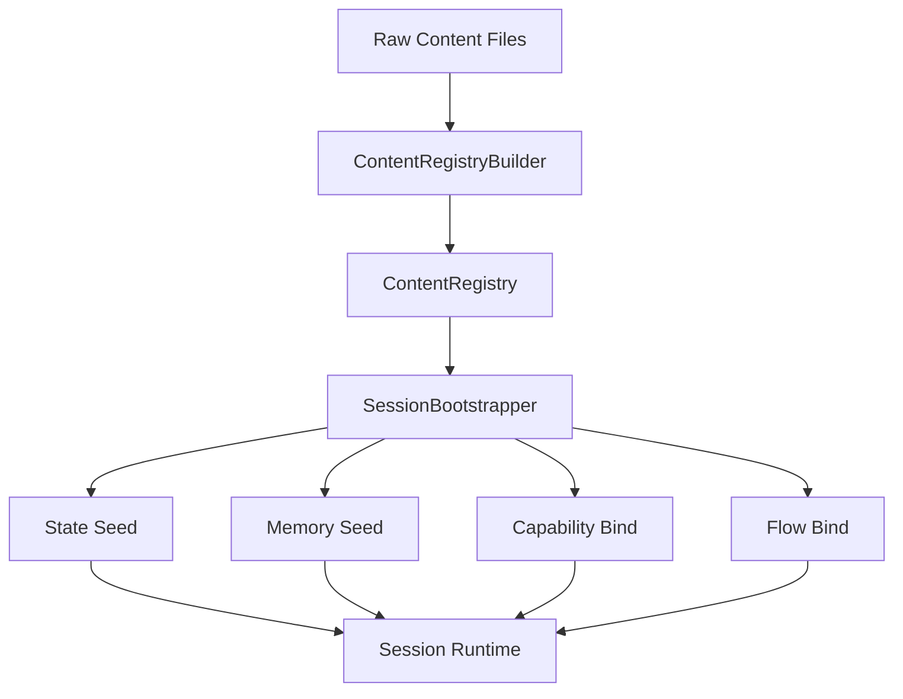

# Content Registry 与 Session Bootstrap 设计

本文档描述新内容架构中两条关键管线：

- `ContentRegistryBuilder`
- `SessionBootstrapper`

前者负责把分散的内容定义编译成统一 registry。  
后者负责把 registry materialize 成一次真实会话。

## 1. 目标

解决当前几类问题：

- 运行时直接到处读取原始 JSONC
- loader 与内容语义耦合
- 角色、物品、资源、工具来源分散
- 插件默认配置与角色覆盖配置没有统一装配层
- demo 和宿主仍在手工 seed 状态、记忆和角色实例
- 一加新扩展就倾向于新增宿主编译期类型或硬编码装配逻辑

目标形态：

```text
raw content files
-> ContentRegistryBuilder
-> ContentRegistry
-> SessionBootstrapper
-> SessionRuntime / AgentRuntime
```

## 2. ContentRegistryBuilder

## 2.1 职责

`ContentRegistryBuilder` 负责：

1. 扫描已启用的 packs / plugins / 内容目录
2. 读取原始定义
3. 校验 schema
4. 解析依赖
5. 解决 namespace 与 id 冲突
6. 执行 merge / override
7. 产出统一 registry

它不负责：

- 启动角色 runtime
- 执行插件逻辑
- 创建会话状态
- 调用 LLM
- 代替 Python / MCP 侧承担系统扩展行为

## 2.2 输入

建议输入模型：

```text
ContentRegistryBuildRequest
- baseDir
- enabledPackIds
- enabledPluginIds
- includeBuiltin
- environment
- featureFlags
- validationMode
```

其中：

- `enabledPackIds`
  显式启用哪些内容包
- `enabledPluginIds`
  启用哪些 runtime plugin
- `includeBuiltin`
  是否自动包含 builtin pack
- `validationMode`
  `strict / warn / legacy-compat`

## 2.3 扫描来源

建议至少扫描这些来源：

- `data/archetypes`
- `data/item-packs`
- `data/plugins`
- 未来 `data/packs`

处理方式：

- 旧目录先适配成临时 pack 视图
- 新 pack 目录直接按 manifest 读取

也就是说，builder 面向的是“pack-like source”，而不是硬绑旧目录名。
它只收口 source 到 canonical registry，不要求 source 最终都变成宿主专有实现。

## 2.4 中间产物

建议引入两层中间对象：

### Raw Definition

表示“原始读入但未合并”的定义：

```text
RawDefinitionEnvelope
- kind
- definitionId
- sourcePackId
- sourcePath
- schemaVersion
- rawPayload
- extensionMetadata
```

### Resolved Definition

表示“完成 merge / override 后”的最终定义：

```text
ResolvedDefinitionEnvelope
- kind
- definitionId
- sourcePackIds
- resolvedPayload
- provenance
- warnings
- opaqueConfig
```

其中：

- `resolvedPayload` 只保留宿主 bootstrap 必须理解的 canonical 字段
- `opaqueConfig` 用于保留插件私有配置、MCP 扩展字段或暂不纳入 canonical schema 的内容

## 2.5 Registry 输出

建议 `ContentRegistry` 至少包含：

```text
ContentRegistry
- Characters
- Resources
- Items
- Tools
- Skills
- Flows
- WorldFacts
- PluginConfigs
- Diagnostics
```

这里的 `PluginConfigs` 指“可装配的扩展配置视图”，不是要求宿主重写插件逻辑本身。

其中每个 registry entry 建议统一结构：

```text
RegistryEntry<T>
- definitionId
- sourcePackId
- sourcePackIds
- schemaVersion
- rawDefinition
- resolvedDefinition
- provenance
- warnings
- opaqueConfig
```

## 2.6 Merge / Override 规则

这是最关键的部分。

### 角色定义

建议：

- `merge` 为默认策略
- 顶层标量字段后写覆盖前写
- 列表字段可按声明策略：
  - `replace`
  - `append`
  - `append_dedup`

### 资源定义

建议：

- 默认 `error`
- 同 namespace + key 冲突时必须显式声明 override

### 物品定义

建议：

- 默认 `replace`
- 允许 DLC 或 mod 替换显示文案和价格

### 工具 / 技能 / flow

建议：

- id 冲突默认 `error`
- 若声明来自同一逻辑家族，可允许显式 `replace`

### 插件角色配置

建议固定三层：

```text
plugin defaults
-> pack-level overrides
-> character overrides
```

没有角色覆盖时，回退到默认配置。

## 2.7 校验与诊断

`ContentRegistryBuilder` 必须具备诊断输出，而不是只在失败时抛异常。
它的价值是“把输入收口成可验证 registry”，不是“把所有扩展逻辑迁回 C#”。

建议输出：

```text
RegistryDiagnostics
- errors[]
- warnings[]
- appliedOverrides[]
- skippedDefinitions[]
- deprecatedFields[]
```

这对于 mod / DLC / 社区内容非常重要。

## 3. SessionBootstrapper

## 3.1 职责

`SessionBootstrapper` 负责把 `ContentRegistry` 变成一次可运行会话。

它负责：

1. 选择启用哪些角色
2. 生成角色实例
3. 创建初始状态
4. 写入初始记忆
5. 绑定能力与 flow
6. 初始化世界状态
7. 确保运行时 ready

它不负责：

- 重新解析原始内容文件
- 定义 schema
- 运行一轮角色对话
- 重写或吞并 runtime plugin 的业务逻辑

## 3.2 输入

建议输入模型：

```text
SessionBootstrapRequest
- sessionId
- registry
- selectedCharacterIds
- activeCharacterId
- worldSeed
- resourceSeed
- memorySeed
- runtimeOverrides
- enabledPacks
```

其中：

- `worldSeed`
  初始世界事实和时间地点
- `resourceSeed`
  初始资源值
- `memorySeed`
  private/shared memory 初始写入
- `runtimeOverrides`
  会话级覆盖，例如 demo 或调试场景用

## 3.3 输出

建议输出模型：

```text
SessionBootstrapResult
- sessionId
- instantiatedCharacters
- activeCharacterId
- appliedSeeds
- diagnostics
```

## 3.4 核心阶段

建议拆成这几步：

### Step 1: Resolve Character Instances

从 `CharacterArchetypeDefinition` 派生出：

```text
CharacterInstanceDefinition
- characterId
- displayName
- archetypeId
- profile
- bindings
- initialLocation
```

这里要解决：

- 实际使用哪个角色 id
- 同一 archetype 是否允许多实例
- 别名和显示名如何落地

### Step 2: Seed Resources

把：

- `ResourceDefinition.defaultValue`
- pack / plugin 默认值
- session request 覆盖值

合成为初始资源状态。

建议优先级：

```text
resource schema default
-> plugin default
-> character override
-> session seed override
```

### Step 3: Seed Memory

按三类来源写入：

- world facts
- shared memories
- private character memories

建议不要让 archetype 自己直接包含大量“运行时记忆记录”，而是：

- archetype 提供原始素材
- bootstrap 转换为 memory seed

### Step 4: Bind Capabilities

根据：

- builtin tool defs
- plugin runtime capabilities
- skill/tool mapping
- character restrictions

形成该角色本会话可见的 capability snapshot。

这里的 bind 只做装配，不做能力实现迁移；真正的动态执行仍由 builtin executor 或 Python / MCP plugin 承担。

### Step 5: Bind Flow

根据：

- builtin flow
- plugin registered flow
- session override

决定：

- 默认 chat flow
- 可用 subgraph
- 可用 specialized flow

### Step 6: Ensure Runtime Ready

最后再把实例化结果交给：

- context store
- runtime hub
- session runtime

使角色真正 ready。

## 3.5 Bootstrap 的关键边界

### 角色卡不直接创建运行时对象

角色卡只是定义。  
bootstrap 才负责实例化。

### 插件配置不直接写状态库

插件配置只提供 seed 规则和覆盖值。  
真正写状态的是 bootstrap。

同理，插件配置也不要求全部先编译成宿主专用对象；bootstrap 只消费 canonical 投影和必要的 opaque config。

### registry 是只读输入

bootstrap 不应回写 registry。  
registry 是编译产物，不是会话状态容器。

## 4. 两者协同关系



## 5. 迁移建议

## 第一阶段

目标：

- 维持旧目录
- 引入统一 registry 视图

做法：

- `backgrounds` 适配成 character archetype source
- `mods` 适配成 item source
- `plugins/*/state_defs.jsonc` 适配成 resource source

## 第二阶段

目标：

- pack manifest 正式化
- 插件默认配置 / 角色覆盖配置标准化

## 第三阶段

目标：

- demo 与宿主改走 `SessionBootstrapper`
- 停止手工 seed

## 6. 当前最值得优先落地的内容

如果要真正开始实现，我建议顺序是：

1. `ContentRegistryBuilder` 的最小只读版本
2. `CharacterArchetypeDefinition` / `ResourceDefinition` / `ItemDefinition` 校验器
3. 插件默认配置与角色覆盖配置合并器
4. `SessionBootstrapper` 的最小版本
5. 让 `character-agent` demo 改用 bootstrap

## 7. 结论

`content-schema.md` 解决的是“定义长什么样”。  
`ContentRegistryBuilder + SessionBootstrapper` 解决的是：

- 定义如何被编译
- 定义如何被实例化

宿主侧真正需要长期稳定维护的，只是最小 canonical schema 与 registry/bootstrap 规则。  
大多数扩展逻辑、策略实现和协议适配仍应继续留在 Python / MCP 一侧。

这两层补齐之后，新的内容系统才真正成立。
