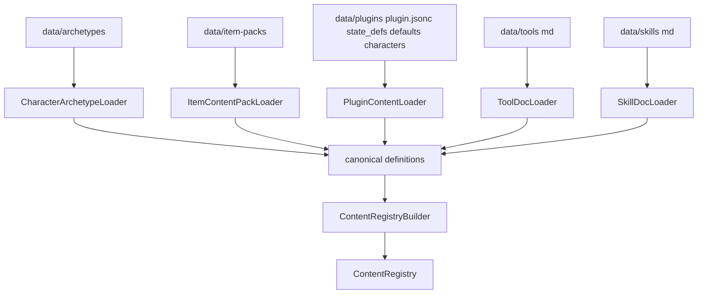
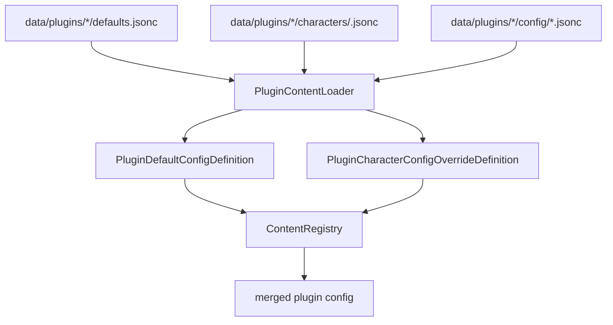
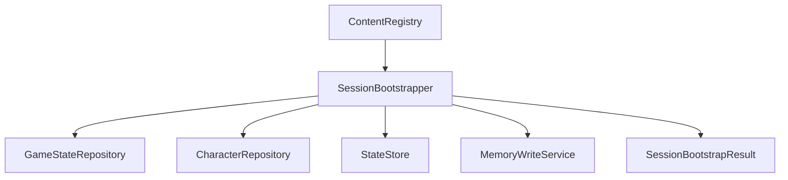
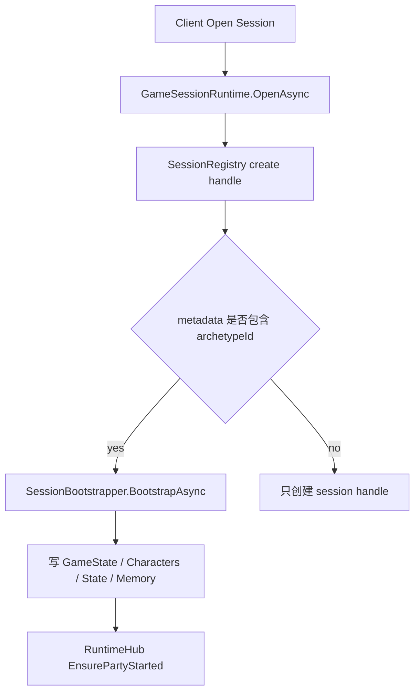
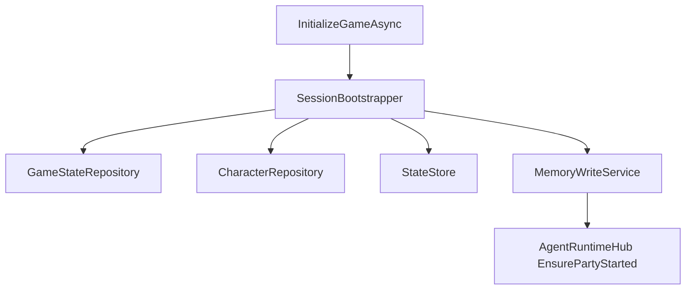
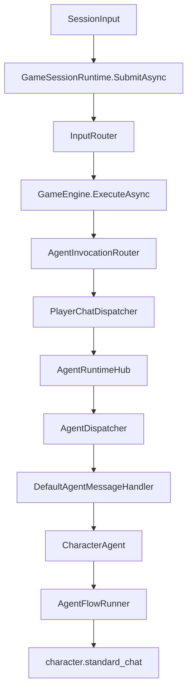
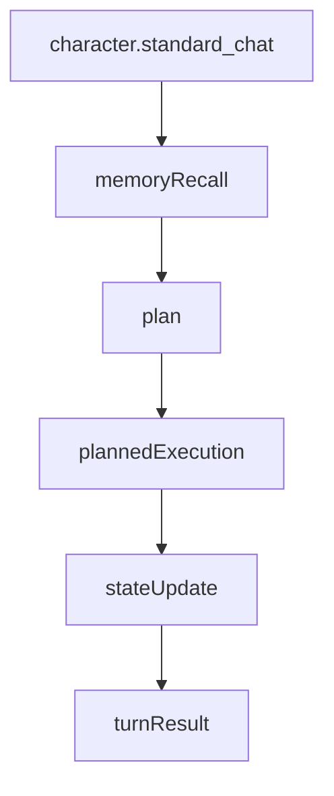
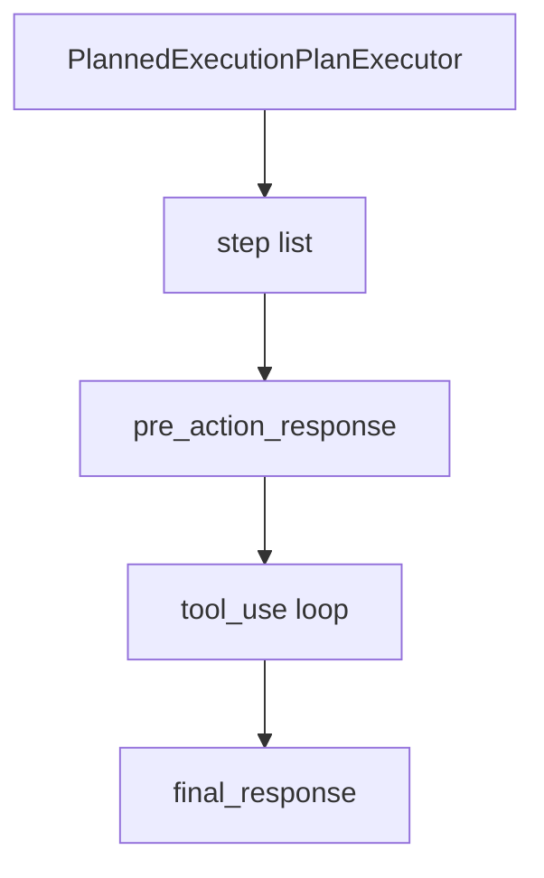
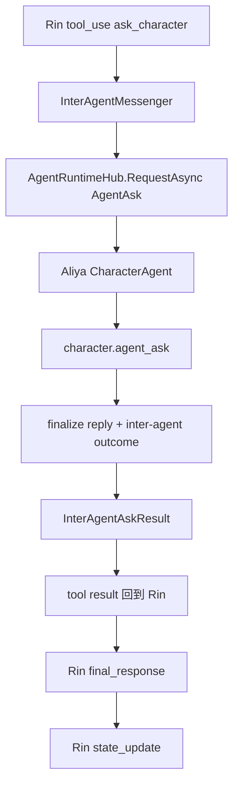
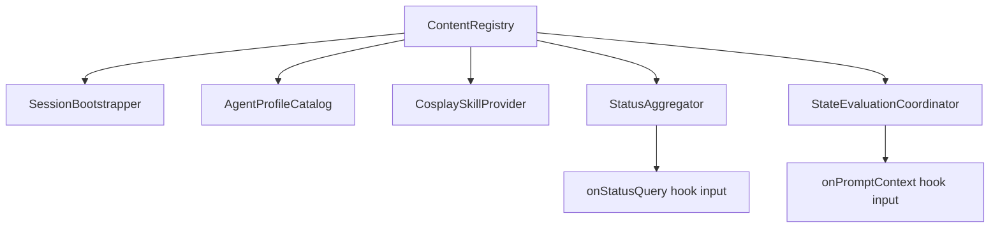

# 输入流与运行时数据流

本文档描述当前新架构下，从内容输入到角色运行时的主要数据流转路径。

目标不是解释所有实现细节，而是明确：

- 新内容入口在哪里
- 会话初始化怎么进入运行时
- 玩家输入如何进入 Agent
- 多角色协作和插件配置如何参与

## 1. 总览

当前系统已经形成两条主入口：

1. **内容/初始化入口**
   - `raw content -> ContentRegistry -> SessionBootstrapper -> persisted runtime state`
2. **对话/运行时入口**
   - `session input -> GameSessionRuntime -> GameEngine -> AgentRuntime -> CharacterAgent`

这意味着：

- 新 schema 模式已经不再只是文档概念
- 新内容装配已经开始接管初始化链路
- 角色运行时也已经开始消费新输入流的结果

## 2. 内容装配流

原始内容来源现在直接进入 canonical schema 编译层，再进入统一 registry。

说明：

- `backgrounds / mods / plugins / tools / skills` 已经不再绕过 registry 直接喂业务
- 运行时与业务层消费的事实源是 `ContentRegistry`

## 3. 插件配置合并流

插件默认配置与角色覆盖配置已经是独立输入流的一部分。

当前支持：

- `defaults.jsonc`
- `characters/<id>.jsonc`

## 4. 会话初始化流

`SessionBootstrapper` 现在已经不仅返回只读结果，还会真正写入初始化状态。

Bootstrap 当前负责：

- materialize 角色实例
- 选择 active character
- 写入 `GameState`
- 写入角色记录
- seed 资源状态
- 写入 shared/private memory
- 输出 diagnostics

## 5. Session Runtime 入口

当前 `GameSessionRuntime` 已经开始接入 bootstrap。

### 5.1 Open Session

### 5.2 Initialize Game

说明：

- `InitializeGameAsync` 已改走 bootstrap
- `OpenAsync` 也支持通过 metadata 直接触发初始化

## 6. 玩家输入到角色运行时

一旦 session 初始化完成，玩家输入就会进入标准运行时主链：

## 7. 角色回合内部流

当前标准角色回合 flow：

其中 `plannedExecution` 内部是局部复合执行器：

## 8. 多角色协作流

角色间内部咨询已经是标准运行时链的一部分：

这条链说明：

- 角色间调用不是底层 LLM 直连
- 被咨询角色仍然作为完整 Agent 被调度
- 内部咨询结果会回到调用角色，再进入最终回复和状态结算

## 9. 新内容装配结果的运行时消费点

当前新输入流已经开始进入运行时消费面，不再只停留在 bootstrap。

目前已接入的消费点包括：

- `CharacterArchetypeAgentProfileCatalog`
- `BackgroundCosplaySkillProvider`
- `StatusAggregator`
- `StateEvaluationCoordinator`

并且：

- merged plugin config 已经会进入 `onPromptContext`
- merged plugin config 已经会进入 `onStatusQuery`

## 10. 当前状态判断

当前不是“旧链路完全消失”的状态，而是：

### 已开始接管的部分

- content registry
- plugin config merge
- session bootstrap
- runtime hook input
- agent profile / cosplay skill 输入

### 当前剩余的历史约束

- SQLite 持久化列名仍沿用 `archetype_id`
- `data/archetypes` 与 `data/item-packs` 目录名尚未重命名

所以现在最准确的判断是：

**新输入流已经成为主事实源；当前剩余的是少量存储层和目录层的历史命名。**

## 11. 下一步建议

接下来最自然的工作顺序是：

1. 评估是否需要重命名 SQLite 列 `archetype_id`
2. 评估是否需要把 `data/archetypes` / `data/item-packs` 调整为更中性的目录命名
3. 在后续新功能中禁止重新引入旧内容模型和旧调用链

这三步做完后，新 schema 模式就会彻底只剩历史命名债，而不再存在旧架构调用链。
