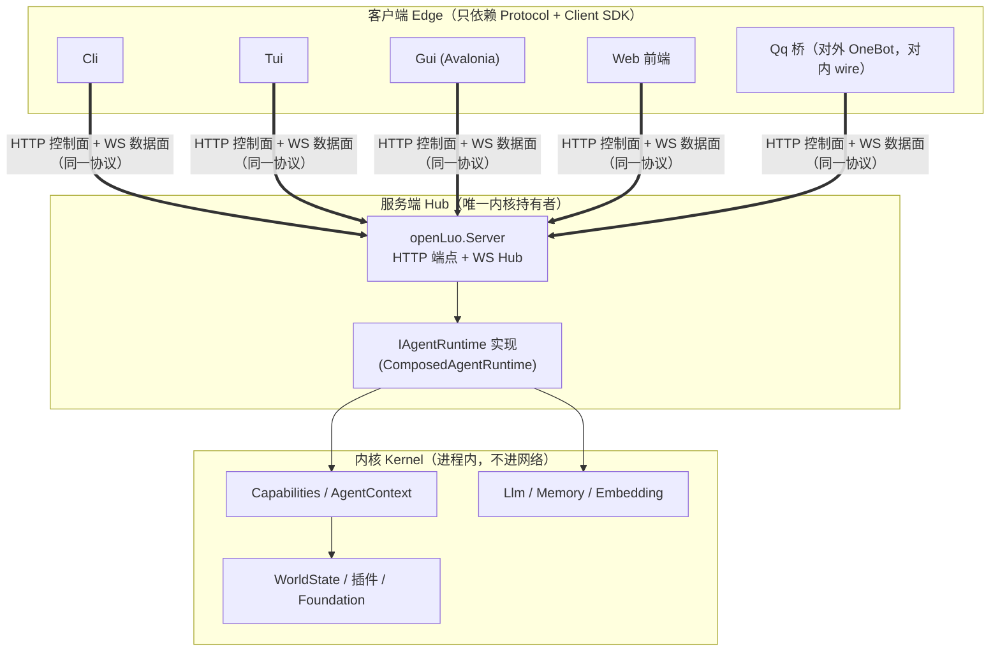
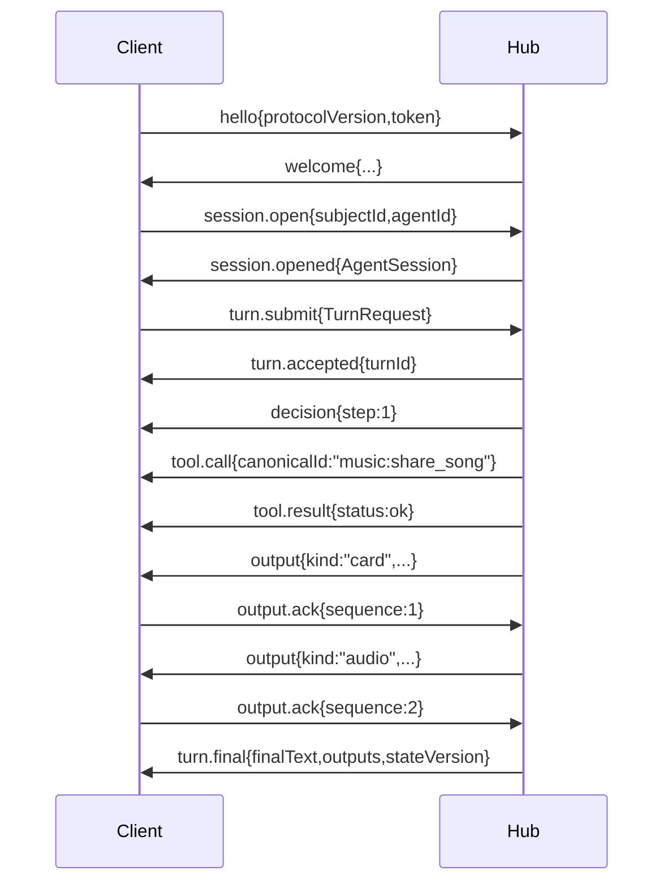

# openLuo 中心服务架构 & Wire 协议 v1（草案）

> 目标：把当前「单进程多入口」演进为「**中心 Hub + 瘦客户端**」，两侧通过
> **同一套 Wire 协议**（HTTP 控制面 + WebSocket 数据面）通信；Hub↔Hub 联邦复用同一协议。

---

## 1. 目标与约束

| 目标 | 说明 |
| --- | --- |
| 严格 server/client 分离 | 内核（能力/记忆/世界/插件/LLM）只存在于 Hub；客户端只做 I/O 与渲染 |
| 两类通信 | **HTTP**（控制面：会话/管理/目录，请求-响应）+ **WebSocket**（数据面：回合流、事件、输出推送） |
| 同一套协议 | 客户端↔Hub、Hub↔Hub、以及未来 Web 前端，全部走同一 `Envelope` + 同一消息类型表 |
| 中心服务式 | 一个 Hub 服务 N 个客户端连接 / M 个用户（subject）/ K 个并发会话 |

**非目标（v1）**：客户端离线自治、协议二进制编码（MessagePack 留待 v2）、客户端插件加载。

---

## 2. 分层总览



**边界规则（硬性）**

1. 客户端**不得**引用任何内核程序集（`Capabilities`/`AgentContext`/`Llm`/`Memory`/`Embedding`/`Foundation`）；只引用 `openLuo.Protocol` + `openLuo.Client`。
2. `openLuo.Protocol` **零业务依赖**（仅 DTO/枚举/常亮），是唯一的跨边界契约。
3. 内核**不感知**网络：Hub 负责把内核的 `TurnEvent`/`OutputItem` 映射为 wire 消息。
4. Hub 可同时扮演客户端（联邦/A2A 场景），因为两侧同一协议。

---

## 3. 程序集划分（目标）

| 层 | 程序集 | 职责 | 依赖 |
| --- | --- | --- | --- |
| 协议 | **`openLuo.Protocol`（新）** | Envelope、消息类型表、DTO、错误码、版本常量 | 无 |
| 服务端 | **`openLuo.Server`（新）** | Kestrel 宿主、HTTP 端点、WS Hub、`IAgentRuntime`→wire 适配、鉴权、会话路由 | Protocol + 内核 |
| 服务端 | `openLuo`（改造） | 组合根/入口：`--serve` 拉起 Hub | Server + 内核 |
| 客户端 | **`openLuo.Client`（新）** | 连接管理、重连、会话句柄、协议编解码、请求-响应关联 | Protocol |
| 客户端 | **`openLuo.Client.Cli/.Tui/.Gui/.Qq`（新，或改造现有）** | 各入口 UI | Protocol + Client |
| 内核 | `openLuo.Foundation`（拆） / `Capabilities` / `AgentContext` / `Llm` / `Memory` / `Embedding` / `WorldState` | 见 §11 迁移 | — |

---

## 4. 协议总则

### 4.1 传输

| 面 | 传输 | 用途 | 生命周期 |
| --- | --- | --- | --- |
| 控制面 | `HTTP/1.1` + `application/json` | 会话增删查、目录、健康、鉴权、轮询 fallback、资产拉取 | 短连接 |
| 数据面 | `WebSocket` 文本帧（JSON，与 HTTP 同一 Envelope） | 回合提交、事件流、输出推送与 ack、状态变更 | 长连接 |

> 所有 JSON 字段名 `camelCase`；时间为 RFC3339 UTC（`2026-10-09T16:39:17.677Z`）；id 为 ULID 字符串。

### 4.2 统一信封 Envelope

HTTP body 与 WS 帧**共用同一结构**：

```jsonc
{
  "v": 1,                          // 协议版本（major），必须匹配
  "id": "01J8Z...",                // 本条消息 id（ULID）
  "type": "turn.submit",           // 消息类型（点分命名空间）
  "ts": "2026-10-09T16:39:17.677Z",
  "sessionId": "sess_01J8Z...",    // 可选：会话域消息携带
  "traceId": "01J8Z...",           // 可选：链路追踪
  "replyTo": "01J8Z...",           // 可选：响应/结果指向请求 id
  "data": { },                     // 类型特定载荷
  "error": { "code": "…", "message": "…", "retryable": false, "details": {} }
}
```

- 请求/响应式消息：服务端以 `replyTo = 请求id` 回填；HTTP 端点直接返回 Envelope。
- 事件式消息：服务端主动推送，`type` 为事件类型。
- 未知 `type`：接收方**必须忽略**（前向兼容），并可选回 `protocol.unknown_type`。

### 4.3 版本协商

- 客户端首帧 `hello` 携带 `protocolVersion`（major 整数）与 `features[]`（能力开关）。
- 服务端 `welcome` 返回 `protocolVersion`、`serverVersion`（semver）、`features[]`（交集）、`heartbeatIntervalSec`。
- major 不匹配 → 服务端回 `protocol.version_mismatch` 并关闭；minor/feature 通过 `features` 协商。

### 4.4 鉴权

| 阶段 | 方式 |
| --- | --- |
| 取 token | HTTP `POST /v1/auth/token`（clientId + secret，或 API key）→ `{ token, expiresAt }` |
| HTTP 调用 | `Authorization: Bearer <token>` |
| WS 握手 | 连接后**首帧** `hello` 必须携带 `token`；未通过前服务端不处理其它消息，超时关闭 |

- 角色：`admin`（管理/目录全量）、`user`（自有会话）、`edge`（平台桥，代表多用户）。
- v1 允许 `auth.anonymous` 开关用于本机开发（配置项 `server.allowAnonymous`）。

### 4.5 错误模型

`error.code` 命名：`<domain>.<reason>`，`domain ∈ {protocol, auth, session, turn, capability, asset, server, rate}`。

| code | 语义 | retryable |
| --- | --- | --- |
| `protocol.version_mismatch` | 协议 major 不符 | false |
| `protocol.bad_envelope` | Envelope 结构非法 | false |
| `auth.unauthorized` | token 缺失/无效 | false |
| `auth.forbidden` | 无该会话/角色权限 | false |
| `session.not_found` | 会话不存在或已关闭 | false |
| `session.limit_exceeded` | 超过并发会话上限 | true |
| `turn.busy` | 该会话已有进行中回合 | true |
| `turn.cancelled` | 回合被取消 | false |
| `turn.budget_exceeded` | 决策预算耗尽 | false |
| `capability.confirmation_required` | 需用户确认（见 §8） | — |
| `capability.failed` | 能力执行失败 | true |
| `asset.not_found` | 资产引用失效 | true |
| `rate.limited` | 限流 | true |
| `server.internal` | 未分类错误 | true |

### 4.6 幂等与顺序

- `turn.submit` / `message.append` 携带 `data.idempotencyKey`；重复 key 返回既有 `turnId`，不重复执行。
- 输出类事件带 `data.sequence`（会话内单调），客户端按序渲染；`output` 类需 `output.ack`（见 §6）。

---

## 5. HTTP 控制面接口

统一前缀 `/v1`；响应体为 Envelope（`data` 承载结果）。错误用 HTTP 4xx/5xx + Envelope.error 双写。

### 5.1 系统

| 方法 | 路径 | 说明 |
| --- | --- | --- |
| GET | `/v1/health` | 存活/就绪；`data: {status, uptimeSec, mcpHealthy, extensionsLoaded}` |
| GET | `/v1/version` | `data: {serverVersion, protocolVersion, features[]}` |

### 5.2 鉴权

| 方法 | 路径 | 请求 `data` | 响应 `data` |
| --- | --- | --- | --- |
| POST | `/v1/auth/token` | `{clientId, secret?, apiKey?}` | `{token, expiresAt, role}` |

### 5.3 目录

| 方法 | 路径 | 说明 | 响应 `data` |
| --- | --- | --- | --- |
| GET | `/v1/agents` | 可用角色/Agent 目录 | `{agents: [{agentId, displayName, avatar?, tags[]}]}` |
| GET | `/v1/capabilities` | 能力目录（可带 `?sessionId=` 过滤权限/场景） | `{version, capabilities: [CapabilityDescriptor]}`（见 §7.4） |
| GET | `/v1/config/summary` | 非敏感配置摘要（admin） | `{llm: {...}, server: {...}}` |

### 5.4 会话

| 方法 | 路径 | 请求 `data` | 响应 `data` |
| --- | --- | --- | --- |
| POST | `/v1/sessions` | `{subjectId, agentId, clientType, clientId, conversationId?, meta?}` | `AgentSession`（§7.1） |
| GET | `/v1/sessions/{id}` | — | `AgentSession` |
| DELETE | `/v1/sessions/{id}` | — | `{closed: true}` |
| GET | `/v1/sessions/{id}/context` | `?region=&format=` | `{summary, regions: [{region, content, priority, source, status}]}` |
| GET | `/v1/sessions/{id}/state` | — | 世界状态只读投影 `{version, values: {...}}`（若扩展提供） |

### 5.5 回合（无 WS 客户端的 fallback + 异步提交）

| 方法 | 路径 | 请求 `data` | 响应 |
| --- | --- | --- | --- |
| POST | `/v1/sessions/{id}/turns` | `TurnRequest`（§7.2） | `202` + `data: {turnId, accepted: true}` |
| GET | `/v1/turns/{turnId}` | — | `{turnId, status: running\|done\|failed, result?, outputs[]}` |
| POST | `/v1/turns/{turnId}/cancel` | — | `{cancelled: true}` |
| POST | `/v1/sessions/{id}/messages` | `{senderName?, text, blocks?, meta?}` | `{appended: true}`（`.AppendMessage`：看但不回） |

### 5.6 资产（二进制解耦，见 §9）

| 方法 | 路径 | 说明 |
| --- | --- | --- |
| GET | `/v1/assets/{assetId}` | 返回原始字节（`Content-Type` 由资产决定），用于 image/audio/file |
| HEAD | `/v1/assets/{assetId}` | 元数据（size/mime/checksum） |

---

## 6. WebSocket 数据面协议

- 端点：`GET /v1/stream`（`Upgrade: websocket`）。
- 一条连接可**订阅多个会话**；服务端按 `sessionId` 路由事件。
- 客户端命令（C→S）需 `id`；服务端事件（S→C）携带 `replyTo`（若由命令触发）或独立。

### 6.1 客户端 → 服务端（命令）

| type | `data` | 说明 |
| --- | --- | --- |
| `hello` | `{protocolVersion, token, clientId, clientType, features[]}` | 必须首帧 |
| `session.open` | `{subjectId, agentId, conversationId?, meta?}` | 开会话（等价 HTTP POST /sessions） |
| `session.subscribe` | `{sessionId}` | 订阅某会话的 output/state 事件（多客户端可共订） |
| `session.unsubscribe` | `{sessionId}` | 退订 |
| `session.close` | `{sessionId}` | 关闭会话 |
| `turn.submit` | `TurnRequest` + `{idempotencyKey}` | 提交回合（流式结果经事件返回） |
| `turn.cancel` | `{turnId}` | 取消进行中回合 |
| `message.append` | `{sessionId, senderName?, text, blocks?, meta?}` | 写入历史不触发回合 |
| `output.ack` | `{sequence}` | 已成功投递（对应 `IOutputQueue.AckAsync`） |
| `output.fail` | `{sequence, permanent}` | 投递失败（对应 `FailAsync`） |
| `confirm.response` | `{requestId, approved, reason?}` | 高危能力确认结果（§8） |
| `ping` | `{}` | 心跳 |

### 6.2 服务端 → 客户端（事件）

| type | `data` | 对应内核 |
| --- | --- | --- |
| `welcome` | `{protocolVersion, serverVersion, features[], heartbeatIntervalSec, clientId}` | 协商结果 |
| `session.opened` | `AgentSession` | `OpenSessionAsync` |
| `session.closed` | `{sessionId, reason}` | 会话结束 |
| `turn.accepted` | `{turnId, sessionId}` | 回合受理 |
| `decision` | `{turnId, step, modelToolName?, note?}` | `TurnEvent.kind=decision` |
| `tool.call` | `{turnId, callId, canonicalId, arguments}` | 工具发起 |
| `tool.result` | `{turnId, callId, status, preview?, outputsRef?}` | `TurnEvent.kind=tool_result` |
| `output` | `OutputItem`（§7.3） | `IOutputQueue` 推送（**即发**，D50） |
| `turn.final` | `TurnResult`（§7.5） | `TurnEvent.kind=final` |
| `context.updated` | `{sessionId, regions[]}` | 上下文快照变更（可选/调试） |
| `state.updated` | `{sessionId, version, patch[]}` | 世界状态变更 |
| `confirm.request` | `{requestId, turnId, canonicalId, risk, summary, argsPreview}` | 高危能力需确认 |
| `error` | `{code, message, retryable, details}` | 关联 `replyTo` |
| `pong` | `{ts}` | 心跳应答 |

### 6.3 典型时序（流式回合）



> 注意：`output` 事件在回合进行中**即发**（对应现有"音频生成即入队"），不等 `turn.final`。

---

## 7. 领域对象 Wire 映射

### 7.1 AgentSession

```jsonc
{ "sessionId":"sess_…", "subjectId":"u_…", "agentId":"companion", "conversationId":"conv_…", "createdAt":"…" }
```

### 7.2 TurnRequest

```jsonc
{
  "turnId":"01J…",            // 可缺省，服务端生成
  "actorId":"player",          // 或角色 id
  "sourceId":"cli",            // 来源：cli|tui|gui|qq|web|hub
  "channelId":"…",
  "senderName":"…",
  "text":"…",
  "blocks":[],                 // 多模态块（image/audio/file/card）
  "meta":{ },                  // 平台元数据（scene/sender/channel）
  "budgets":{ },               // 可选：决策预算覆盖
  "idempotencyKey":"…"
}
```

### 7.3 OutputItem（`output` 事件 / `turn.final.outputs[]`）

```jsonc
{
  "id":"out_…",
  "sequence":2,
  "kind":"audio",              // text|image|audio|file|card|asset
  "payload":"data:audio/wav;base64,…",  // 小内容内联；大内容改 assetRef（§9）
  "assetRef":{ "id":"ast_…", "mime":"audio/wav", "size":183402 },  // kind=asset 或大内容
  "sourceCapability":"tts:speak",
  "conversationId":"conv_…",
  "fingerprint":"…",
  "createdAt":"…"
}
```

`kind` 语义与现有 `ReplyItemKind` 一一对应；`card.payload` 为结构化不透明对象，未知结构客户端**必须降级**为文本。

### 7.4 CapabilityDescriptor（`/v1/capabilities`）

```jsonc
{
  "canonicalId":"music:share_song",
  "displayName":"分享歌曲",
  "summary":"…", "usage":"…",
  "kind":"extension",           // builtin|extension|mcp|a2a|agent
  "providerId":"music",
  "version":"1.0.0",
  "sideEffect":"external",      // pure|local|external
  "risk":"medium",              // low|medium|high
  "requiresConfirmation":false,
  "inputSchema":{ "type":"object", "properties":{…} }  // JSON Schema（前端可渲染表单/确认 UI）
}
```

### 7.5 TurnResult（`turn.final`）

```jsonc
{
  "turnId":"01J…", "success":true,
  "finalText":"…",
  "outputs":[ OutputItem… ],
  "terminationReason":"FinalReply",  // FinalReply|BudgetExhausted|Error|Cancelled|…
  "terminationDetail":null,
  "stateVersion":42
}
```

> `steps`（决策轨迹）只走 `decision`/`tool.*` 事件，不塞进 `turn.final`，避免大帧。

---

## 8. 确认与权限（高危能力）

现有内核已有 `CapabilityDescriptor.RequiresConfirmation` / `RiskLevel` / `CapabilityPermissions`。协议化：

1. 决策循环遇 `requiresConfirmation` 能力 → Hub 发 `confirm.request{requestId, turnId, canonicalId, risk, summary, argsPreview}`。
2. 客户端渲染确认 UI → 回 `confirm.response{requestId, approved}`。
3. 未在超时内响应 → 该能力视为拒绝（`capability.failed`，`retryable:false`）。
4. 客户端需声明 `features:["confirm"]`；不支持确认的客户端所连会话，Hub 对高危能力**直接拒绝**（安全默认）。

---

## 9. 资产与二进制（避免大帧）

| 内容类型 | 传输 |
| --- | --- |
| `text` / `card`（结构化小内容） | 内联 `payload`（字符串 / JSON 对象） |
| `image` / `audio` / `file` / `asset`（二进制） | **一律** asset store：消息携带 `assetRef`，客户端 `GET /v1/assets/{id}` |

> **v1 既定（决策 #2）**：二进制不内联 data URL，全部走 assetRef。

- asset store：`{ assetId, mime, size, checksum(sha256), createdAt, ttl }`；按会话隔离访问权限；**SQLite 持久化**（决策 #3）。
- 好处：WS 帧恒定小、支持断点/重试、多客户端共享同一资产、便于缓存、Hub 重启资产不丢。

---

## 10. Hub ↔ Hub 联邦（复用同一协议）

中心服务式不等于单点。多个 Hub 之间以**客户端角色**互连，复用同一 Wire 协议：

- 发现：`GET /v1/agents` + Agent Card（现有 A2A 能力映射为"远程 Hub 的 session.open + turn.submit"）。
- 调用：Hub A 对 Hub B 执行 `session.open` + `turn.submit`，消费 B 的 `output`/`turn.final`。
- 现有 `openLuo.Capabilities.A2A` 从"skill 映射"升级为"**协议级联邦**"，但对外仍是 `RemoteAgent` 能力，内核无感。

---

## 11. 与现有内核的映射 / 迁移路径

| 现有 | 去向 |
| --- | --- |
| `IAgentRuntime` | **保留**为 Hub 内部门面；`openLuo.Server` 做 wire 适配 |
| `TurnEvent{decision\|tool_result\|output\|final}` | 直接映射为 `decision`/`tool_result`→`tool.result`/`output`/`turn.final` |
| `IOutputQueue`(Enqueue/Read/Ack/Fail) | `Read` 循环 → 推 `output` 事件；`Ack/Fail` ← `output.ack/fail` 命令 |
| `StreamTurnAsync`（当前退化实现） | 需还原为**真流式**（逐 `decision`/`tool`/`output` 产出），否则协议无法流式 |
| `CapabilityCatalogSnapshot`/`CapabilityDescriptor` | `GET /v1/capabilities` |
| `SessionStore`（内存） | Hub 侧会话注册表，**改为 SQLite 持久化**（决策 #3） |
| `openLuo.Cli/Tui/Gui/Qqbot`（进程内直连） | 改为 `openLuo.Client.*`（经 protocol 连 Hub） |
| 宿主 `openLuo`（多入口 exe） | 拆为 `--serve`（Hub）与各客户端 exe；不再聚合 UI 框架 |

**建议实施顺序**（与既有架构重构 P1–P5 合流）：

1. 建 `openLuo.Protocol`（纯 DTO + Envelope + 错误码）——零风险。
2. 建 `openLuo.Server`（Kestrel：先 `/v1/health` + `/v1/sessions` + WS `hello`/`turn.submit`/`output`/`turn.final`），复用一个既有客户端（如 Cli）验证闭环。
3. 建 `openLuo.Client` SDK + 改造 `Cli` 走协议。
4. 依次迁移 `Tui` / `Gui` / `Qq 桥`。
5. 承接 P1–P5 的程序集切分（内核契约独立、插件断开宿主 exe 依赖）。
6. assetRef（§9，v1 即做）与 Hub 联邦（§10）。

---

## 12. 部署形态

| 形态 | 描述 |
| --- | --- |
| 单机 | `openLuo --serve` 起 Hub（默认 `127.0.0.1:8674`）；本机客户端连接；开发可用 `allowAnonymous` |
| 远程 | Hub 部署服务器（TLS + token）；多客户端跨网连接 |
| 中心服务式 | 单 Hub 多用户/多角色/多会话；客户端仅 I/O |
| 联邦 | 多 Hub 互连，各自持有本地内核与状态 |

**端口/配置**（`server.jsonc`）：`listen`（`host:port`）、`tls`（cert/key 或反代）、`allowAnonymous`、`maxSessionsPerClient`、`heartbeatSec`、`assetTtlSec`、`assetMaxInlineBytes`。

---

## 13. 已确认决策（2026-10-09）

| # | 决策项 | 取值 |
| --- | --- | --- |
| 1 | QQ 桥定位 | **客户端 edge**：对内走本协议连 Hub，对外仍是 OneBot 服务端（LLBot 接入） |
| 2 | 二进制策略 | **v1 直接上 assetRef**：二进制一律走 asset store + `GET /v1/assets/{id}`，不内联 data URL |
| 3 | 持久化 | **v1 即落盘（SQLite）**：会话与资产复用 `game.db` 基础设施，Hub 重启可恢复 |
| 4 | 实施顺序 | **先建 `openLuo.Protocol`（纯契约，零依赖）**，再 `openLuo.Server` 最小闭环 |
| 5 | 端口 | `127.0.0.1:8674`（避让 LLBot 的 3001/3010） |

仍开放：TLS 终结方式（Hub 直出 vs 反向代理）——实施 Server 时再定。
