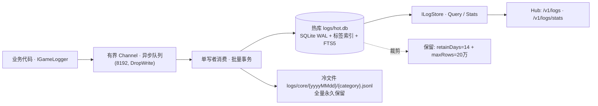

# 日志存储：热库 + 冷文件

> 目标：类 Grafana/Loki 的日志存储——**关键信息进热库（可 SQL/全文热查询）**，**全量日志落盘文件**（永久保留）。

## 1. 分层



映射：`module`/`level` = labels（索引列）；`data` = 结构化 payload；热库 = 近期块（SQL/全文热查）；冷文件 = 长存块（全量、按天分目录）；`Stats` = 时间桶指标。

## 2. 热库表（`logs/hot.db`，WAL，独立于业务库）

```sql
CREATE TABLE logs (
  id INTEGER PRIMARY KEY,          -- 写入序（游标分页）
  ts_ms INTEGER NOT NULL,          -- Unix ms
  level INTEGER NOT NULL,          -- 1=debug 2=info 3=warn 4=error（可比较）
  level_name TEXT NOT NULL,
  module TEXT NOT NULL,            -- category 首段
  category TEXT NOT NULL,
  source TEXT,                     -- file:line
  msg TEXT NOT NULL,
  data TEXT,                       -- JSON（>4KB 截断）
  session_id TEXT, turn_id TEXT    -- 关联维度（串会话/回合时间线）
);
CREATE INDEX ix_logs_ts / ix_logs_lvl_ts / ix_logs_mod_ts / ix_logs_sess_ts;
CREATE VIRTUAL TABLE logs_fts USING fts5(msg, content='logs', content_rowid='id', tokenize='unicode61');
-- 触发器 logs_ai / logs_ad 同步 FTS
```

- **FTS5 可用性**：`SQLitePCLRaw.lib.e_sqlite3` 编译含 `ENABLE_FTS5`（已核实）。
- 关键词查询转 FTS 短语（引号转义），避免语法注入。

## 3. 写入管道（并发）

| 关注点 | 做法 |
| --- | --- |
| 不阻塞业务 | `Channel(8192, FullMode=DropWrite)`；满则丢弃并计数（`LogStore.DroppedCount`） |
| 吞吐 | 单写者线程 + 每批 ≤`batchSize`(200) **单事务**批量 INSERT |
| 冷文件 | 同批顺序写；**持有 `StreamWriter`**（按分类缓存，不再每行开关文件） |
| 顺序 | `id` 严格递增；冷文件按批顺序追加 |

## 4. 保留与归档（已确认决策）

| 层 | 策略 | 取值 |
| --- | --- | --- |
| 热库 | 双阈值裁剪：`ts_ms < now-retainDays` **或** 行数 > `maxRows`（删最旧）+ `incremental_vacuum` | **14 天 / 20 万行** |
| 热库触发 | 累计新增达 `clamp(maxRows, 50, 50000)` 时裁剪一次（上界 ≈ `maxRows + 阈值`） | — |
| 冷文件 | `logs/core/{yyyyMMdd}/{category}.jsonl`；**永久保留，不删**（不 gzip、不清理） | — |

## 5. 查询

端口：`openLuo.Foundation/Core/Interfaces/ILogStore.cs`

```csharp
Task<IReadOnlyList<LogRecord>> QueryAsync(LogQuery query, CancellationToken ct);
Task<IReadOnlyList<LogBucket>> StatsAsync(DateTimeOffset from, DateTimeOffset to, TimeSpan bucket, CancellationToken ct);
```

`LogQuery`：`From/To/MinLevel/Module/Category/Keyword/SessionId/TurnId/Limit/BeforeId`（`BeforeId` 为倒序游标）。

Hub 端点（`openLuo.Server`）：
- `GET /v1/logs?from=&to=&level=&module=&category=&keyword=&sessionId=&turnId=&limit=&beforeId=` → `LogsResponse{items[], nextBeforeId}`
- `GET /v1/logs/stats?from=&to=&bucket=1m` → `LogStatsResponse{buckets[]}`（`bucket` 支持 `s/m/h/d`）

> **权限**：设计要求 **admin-only**（日志可能含敏感内容）。当前 Server 尚未落地 token 鉴权，端点暂为开放并在代码中标注 TODO，待鉴权（§4.4）落地后收紧。

## 6. 配置（`log.jsonc`）

```jsonc
"log": {
  "level": "info", "outputToConsole": false, "categories": { },
  "hot":     { "enabled": true, "path": "hot.db", "retainDays": 14, "maxRows": 200000, "batchSize": 200, "flushMs": 250 },
  "archive": { "enabled": true, "dir": "core" }
}
```

## 7. 集成点

- `IGameLogger` **不变**；`GameLogger.Write/Plugin` 在有 `LogStore` 时改走 `Enqueue`（热+冷统一），否则回退旧的文件直写（测试/无存储场景）。
- `LogStore` 由 DI 注册（`openLuo/Modules/AppShell/Application/ServiceCollectionExtensions.cs`）：`LogStore` → `ILogStore`；`GameLogger` 注入 `LogStore`。
- Hub `--serve` 注入 `ILogStore` → 两个端点。
- 日志根目录：`<baseDir>/logs`。

## 8. 风险与取舍

| 风险 | 处理 |
| --- | --- |
| 日志阻塞业务 | 有界队列 + DropWrite + 丢弃计数 |
| SQLite 写放大 | 单写者 + 批量事务 + WAL + 独立库文件 |
| 磁盘增长 | 热库双阈值裁剪 + `incremental_vacuum`；冷文件按你要求**不删**（需自行规划磁盘/归档） |
| 敏感信息 | 设计 admin-only；`data` 入库前可扩展掩码 |
| 崩溃丢尾 | 队列中未落盘条目在崩溃时丢失（可接受；关键事件可用 `Error` 级别并缩短 `flushMs`） |
| 热配置变更 | `hot/archive` 在构造时读取，改后需重启（`level/categories` 仍热加载） |

## 9. 后续

- `logs_fts` 索引体积可观 → 可选 `optimize`/重建任务。
- 冷文件检索：需要跨天/历史查询时，提供 `logs` CLI/端点按归档目录扫描（当前仅热库可查）。
- 指标派生：由 `StatsAsync` 驱动错误率/回合曲线，接入 `/v1/metrics` 或前端面板。
