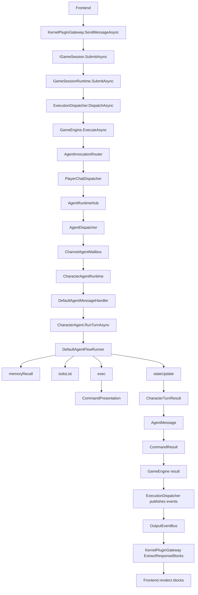

# Agent 编排与消息队列架构走读

日期：2026-07-20

## 结论

当前底层 exec / plugin dispatch 相对干净；臃肿主要集中在 Agent turn orchestration、message/event 双平面、以及 response/presentation 多模型互转。

最大问题不是“代码多”，而是同一语义被多套模型表达：

- `AgentMessage`
- `CharacterTurnResult`
- `CommandResult` / `CommandPresentation`
- `GameEvent` / `TurnMessage`
- `SendMessageResult.Blocks`

建议方向：

```text
Executor 保持纯函数式能力层。
Agent 主聊天改显式 turn pipeline。
多 Agent runtime 保留为高级异步能力，不压在普通 /chat 上。
消息系统拆成 TurnJournal + ClientEventHub。
对外统一 Message，不再把 Block 当 response 顶层协议。
```

---

## 1. 当前主链路

一次 GUI / CLI / QQbot chat 大致走：



### 相对干净的部分

- `GameEngine.ExecuteAsync`：只解析命令、检查 gate、交给 `AgentInvocationRouter`，边界清楚。  
  证据：`openLuo/Modules/Gameplay/Application/Services/GameEngine.cs:21-97`
- `GameApiDispatcher`：attribute route scan + reflection dispatch，职责单一。  
  证据：`openLuo/Modules/GameBridge/Infrastructure/GameApiDispatcher.cs:17-120`
- `McpPluginHost.ExecutePluginCommandAsync`：MCP command → `content[]` → `Block` / `CommandPresentation`，direct base64 image 路径清楚。  
  证据：`openLuo/Modules/PluginRuntime/Infrastructure/McpPluginHost.cs:117-206`
- `KernelPluginGateway`：API facade 仍有兼容职责，但 kernel/plugin split 已经成形。  
  证据：`openLuo/Modules/SessionRuntime/Application/KernelPluginGateway.cs:18-126`

### 臃肿集中区

- `PlayerChatDispatcher` 同时做 input block 解析、asset resolution、hooks、agent loop、confirmation、presentation 合成、plugin after hook、metadata。  
  证据：`openLuo/Modules/Agent/Application/Chat/PlayerChatDispatcher.cs:58-196`
- `CharacterAgent` 构造 `AgentFlowRunRequest` 两次，只为了注入 `MessageEmitter`。  
  证据：`openLuo/Modules/Agent/Application/Agents/Character/CharacterAgent.cs:61-88`
- `DefaultAgentFlowRunner` 是通用 DAG runner，但当前 standard chat 是固定线性 DAG。  
  证据：`openLuo/Modules/Agent/Application/Flow/CharacterStandardChatFlow.cs:13-87` + `openLuo/Modules/Agent/Application/Flow/DefaultAgentFlowRunner.cs:48-174`
- `IOutputEventBus` 同时暴露 `StreamAsync` 和 `Drain`，接口上仍然混合 external stream 和 internal buffer。  
  证据：`openLuo/Modules/SessionRuntime/Core/Interfaces/IOutputEventBus.cs:5-13`
- 四个前端都还在 request-response `SendMessageAsync`，没有真正消费 external event channel。  
  证据：CLI `openLuo/Interfaces/CLI/CliApplication.cs:116-127`、TUI `openLuo/Interfaces/TUI/TuiApplication.cs:213-229`、GUI `openLuo/Interfaces/GUI/ViewModels/MainViewModel.cs:169-184`、QQbot `openLuo/Interfaces/QQbot/QqBotApplication.cs:141-147`

---

## 2. 代码规模信号

统计结果：

```text
openLuo/Modules/Agent          89 files, 6797 lines
openLuo/Modules/SessionRuntime 47 files, 3421 lines
openLuo/Modules/Executor       38 files, 1989 lines
```

抽象数量：

```text
Agent:
  interface      36
  sealed class   92
  class          98

SessionRuntime:
  interface      11
  sealed class   56
  class          59

Executor:
  interface       5
  sealed class   51
  class          53
```

解释：`Executor` 文件多但概念窄；`Agent` 行数和抽象数都高，而且很多抽象不是为了独立替换，而是为了在同一 turn 内搬运状态。

---

## 3. 架构问题清单

### P0 / P1：消息平面仍未真正拆开

现在 `InMemoryOutputEventBus` 实现上已经比之前正确：

```text
PublishAsync:
  state.Queue.Enqueue(event)
  broadcast to Subscribers

StreamAsync:
  only live subscriber channel

Drain:
  one-shot internal queue
```

证据：`openLuo/Modules/SessionRuntime/Application/InMemoryOutputEventBus.cs:12-70`

但接口仍然是：

```csharp
public interface IOutputEventBus
{
    Task PublishAsync(GameEvent @event, CancellationToken ct = default);
    IAsyncEnumerable<GameEvent> StreamAsync(string sessionId, CancellationToken ct = default);
    IReadOnlyList<GameEvent> Drain(string sessionId);
    void Complete(string sessionId);
}
```

证据：`openLuo/Modules/SessionRuntime/Core/Interfaces/IOutputEventBus.cs:5-13`

问题：接口层仍然允许任意调用者把 internal journal 和 external client stream 混用。

建议拆成两个接口：

```csharp
public interface ITurnEventJournal
{
    Task AppendAsync(GameEvent e, CancellationToken ct = default);
    IReadOnlyList<GameEvent> DrainTurn(string sessionId, string turnId);
}

public interface IClientEventHub
{
    Task PublishAsync(ClientEvent e, CancellationToken ct = default);
    IAsyncEnumerable<ClientEvent> SubscribeAsync(string sessionId, string channelId, CancellationToken ct = default);
}
```

进一步拆事件类型：

```text
InternalTurnEvent:
  InputAccepted
  ToolStarted
  ToolResult
  StateUpdateProduced
  TurnCompleted

ClientEvent:
  Message
  Error
  StatusSnapshot
  AttachmentAccepted
```

当前 `GameEventKind` 把两类混在一起：`InputAccepted`、`AgentStep`、`TurnCompleted`、`MessageOutput`、`StatusSnapshot` 都在一个 enum。  
证据：`openLuo/Modules/SessionRuntime/Core/Models/GameEvent.cs:5-17`

---

### P1：Agent 编排层把“固定流程”做成了“动态 DAG”

标准聊天流程是固定线性：

```text
memoryRecall -> todoList -> exec -> stateUpdate -> done
```

证据：`openLuo/Modules/Agent/Application/Flow/CharacterStandardChatFlow.cs:13-87`

但执行器是通用 DAG runner：

- `AgentFlowDefinition`
- `AgentFlowNode`
- `AgentFlowEdge`
- `AgentFlowGuard`
- `DefaultAgentFlowRunner`
- `FlowRoutingExecutor` 多边路由

证据：

- `openLuo/Modules/Agent/Core/Models/Flow/AgentFlowDefinition.cs:5-48`
- `openLuo/Modules/Agent/Application/Flow/DefaultAgentFlowRunner.cs:48-174`

现在 standard chat 没有真实动态分支。`DefaultAgentFlowRunner` 的复杂度主要服务于未来能力，不服务当前主路径。

建议：保留 flow runner 给真正动态 flow，例如多 Agent / agent ask；standard chat 改成显式 pipeline：

```csharp
public sealed class CharacterTurnPipeline
{
    public async Task<CharacterTurnResult> RunAsync(CharacterTurnRequest req, CancellationToken ct)
    {
        var memory = await memoryRecall.LoadAsync(...);
        var ctx = await contextBuilder.BuildAsync(...);
        var todo = await todoPlanner.PlanAsync(ctx, memory);
        var exec = await executor.ExecuteAsync(ctx, todo);
        var state = await stateUpdater.UpdateAsync(ctx, exec);
        return Assemble(ctx, memory, todo, exec, state);
    }
}
```

这会删除或旁路：

- `CharacterStandardChatFlow`
- 4 个 `*FlowNodeExecutor` wrapper
- `Dictionary<string, object?> state` string-key 传递
- `CloneTurnContext` 类似中间搬运逻辑
- `AgentFlowRunRequest` 为主 chat 的 `Inputs["turnContext"]` / `Inputs["presentationProfile"]`

---

### P1：`PlayerChatDispatcher` 是上层最大胖点

`PlayerChatDispatcher.ExecuteAsync` 做了太多事：

- 确保 party runtime started：`line 67`
- 从 `SessionExecutionContext` 取附件并 resolve asset：`lines 68-113`
- chat before hook：`lines 124-128`
- agent dispatch loop：`line 144`
- trace / visible / output / final reply merge：`lines 162-166`
- after hook：`lines 167-173`
- plugin after hook：`lines 174-180`
- presentation assembly：`lines 181-193`
- streamed metadata：`lines 194-195`

证据：`openLuo/Modules/Agent/Application/Chat/PlayerChatDispatcher.cs:58-196`

它还内部维护三套 text buckets：

```csharp
TraceLines
VisibleBlocks
OutputBlocks
FinalReplyMessage.Payload
```

证据：`openLuo/Modules/Agent/Application/Chat/PlayerChatDispatcher.cs:402-408`

而下游又变成：

```text
AgentMessage.VisibleBlocks
AgentMessage.Presentation
CommandResult.Output
CommandResult.Presentation
MessageEvent.Blocks
SendMessageResult.Blocks
```

建议拆成 4 个小组件：

```text
ChatTurnInputBuilder
  - SessionExecutionContext -> PlayerMessage + Blocks + Metadata

AgentTurnLoop
  - pending ability / confirmation / ToolResult continuation only

ChatHookRunner
  - before / after / plugin after

TurnResponseAssembler
  - AgentMessage + hook outputs -> CommandPresentation / metadata
```

`PlayerChatDispatcher` 最终只保留 orchestration：

```csharp
var input = await inputBuilder.BuildAsync(request);
var before = await hooks.BeforeAsync(input);
var outcome = await loop.RunAsync(input, before);
var after = await hooks.AfterAsync(input, outcome);
return assembler.ToCommandResult(input, before, outcome, after);
```

---

### P1：同一个“回复”有太多模型

当前回复会变换多次：

```text
CharacterExecResult
  -> CharacterTurnResult
  -> AgentMessage
  -> CommandResult
  -> MessageEvent/TextOutputEvent
  -> SendMessageResult.Blocks
```

证据：

- `CharacterExecResult`：`openLuo/Modules/Agent/Application/Flow/Nodes/CharacterExecNode.cs:270-277`
- `CharacterTurnResult`：`openLuo/Modules/Agent/Core/Models/Character/CharacterTurnResult.cs:6-19`
- `AgentMessage`：`openLuo/Modules/Agent/Application/Runtime/AgentMessage.cs:19-37`
- `CommandResult` / `CommandPresentation`：`openLuo/Modules/Commanding/Core/Models/Command.cs:16-85`
- `GameEvent`：`openLuo/Modules/SessionRuntime/Core/Models/GameEvent.cs:19-126`

问题：每一层都带一点 presentation / text / metadata，导致以下问题反复出现：

- output 丢失
- output duplicated
- `streamedPublicOutput` 这类 metadata flag 变成跨层协议
- visibility 在 block / message / event 三层重复表达

建议定一个唯一 “turn output aggregate”：

```csharp
public sealed class TurnOutput
{
    public required string TurnId { get; init; }
    public IReadOnlyList<Message> PublicMessages { get; init; } = [];
    public IReadOnlyList<InternalTurnEvent> InternalEvents { get; init; } = [];
    public CharacterStateUpdateResult? StateUpdate { get; init; }
    public bool HasLivePublishedPublicMessage { get; init; }
}
```

然后：

```text
Agent layer returns TurnOutput
Session layer publishes TurnOutput.PublicMessages to ClientEventHub
Session layer appends InternalEvents to TurnJournal
KernelPluginGateway adapts TurnOutput -> SendMessageResult
```

不要让 `CommandResult.Output` 再做主路径回复承载。`CommandResult.Output` 可以保留给 legacy slash command plain text。

---

### P2：`AgentRuntimeHub` / mailbox 对同步 request-response 过度工程化

当前单角色 request：

```text
AgentRuntimeHub.RequestAsync
  -> AgentDispatcher.RequestAsync
  -> ChannelAgentMailbox.EnqueueAsync
  -> CharacterAgentRuntime.RunLoopAsync
  -> DefaultAgentMessageHandler
  -> reply sink TaskCompletionSource
```

证据：

- `openLuo/Modules/Agent/Application/Runtime/AgentRuntimeHub.cs:142-187`
- `openLuo/Modules/Agent/Application/Runtime/AgentDispatcher.cs:46-94`
- `openLuo/Modules/Agent/Application/Runtime/AgentMailbox.cs:15-43`
- `openLuo/Modules/Agent/Application/Runtime/AgentRuntime.cs:90-115`

这个设计适合真正的多 Agent async actor 系统。  
但当前主 chat 是单角色同步 request-response，mailbox 只是在同进程里转一圈。

建议：

- 主 chat：直接调用 `ICharacterTurnService.RunAsync()`
- 多角色 / agent ask / background tasks：继续走 mailbox runtime

也就是：

```text
/chat 主路径:
  PlayerChatDispatcher -> CharacterTurnService

inter-agent:
  MultiCharacterOrchestrator -> AgentRuntimeHub -> mailbox
```

---

### P2：`CharacterAgent.RunTurnAsync` 有明显中间态异味

当前构造两次 `AgentFlowRunRequest`：

```csharp
var flowRequest = new AgentFlowRunRequest { ... };
flowRequest = new AgentFlowRunRequest
{
    ...,
    MessageEmitter = _messageEmitterFactory.Create(flowRequest),
    ...
};
```

证据：`openLuo/Modules/Agent/Application/Agents/Character/CharacterAgent.cs:61-88`

这说明 `MessageEmitter` 的创建时机 / 依赖关系是反的。  
`MessageEmitterFactory.Create()` 需要 request，但 request 又需要 emitter。

建议：

```csharp
var emitter = _messageEmitterFactory.Create(
    sessionId,
    channelId,
    presentationProfile);

var flowRequest = new AgentFlowRunRequest
{
    ...,
    MessageEmitter = emitter
};
```

或者把 factory 输入改成专用小 DTO：

```csharp
public sealed record TurnMessageEmitterOptions(
    string? SessionId,
    string? ChannelId,
    SessionPresentationProfile PresentationProfile);
```

这是低风险立即可做的 cleanup。

---

### P2：`TurnMessage` 是薄壳，且与 `GameEvent.MessageEvent` 高度重叠

`TurnMessage`：

```csharp
TurnId
SessionId
ChannelId
GameId
NodeId
Kind
Message
Success
Error
```

证据：`openLuo/Modules/Agent/Core/Models/Flow/TurnMessage.cs:11-30`

`OutputEventBusTurnMessageEmitter` 只是把它转换成 `MessageEvent` 或 `TurnCompletedEvent`。  
证据：`openLuo/Modules/SessionRuntime/Application/OutputEventBusTurnMessageEmitter.cs:14-48`

问题：这是一层语义很薄的 adapter。它存在的原因是 flow node 想发布消息，但不想依赖 SessionRuntime 的 `GameEvent`。这个边界意图是对的，但当前类型本身没有提供足够价值。

建议二选一：

1. 如果要保留边界：把它升级成真正的 `ClientEvent`，让它成为外部事件协议。
2. 如果不拆事件协议：删掉 `TurnMessage`，flow 直接调用 `IClientMessageSink.PublishAsync(Message message, TurnMetadata meta)`。

不要继续保留 `TurnMessage -> GameEvent` 的中间壳。

---

### P2：frontend delivery 语义不一致

当前四端都走 request-response：

- CLI：`SendMessageAsync` 后 `RenderBlocks`。  
  证据：`openLuo/Interfaces/CLI/CliApplication.cs:116-127`
- TUI：`SendMessageAsync` 后逐 block append。  
  证据：`openLuo/Interfaces/TUI/TuiApplication.cs:213-229`
- GUI：`SendMessageAsync` 后每个 block 变成一条 assistant message。  
  证据：`openLuo/Interfaces/GUI/ViewModels/MainViewModel.cs:169-184`、`254-293`
- QQbot：`SendMessageAsync` 后把 blocks 转 outgoing segments。  
  证据：`openLuo/Interfaces/QQbot/QqBotApplication.cs:141-150`、`361-420`

问题：

- GUI 不能表达“一条 Message 含 image + text”，因为 `AddBlockMessage` 是 per-block 新建 `ChatMessageViewModel`。  
  证据：`openLuo/Interfaces/GUI/ViewModels/MainViewModel.cs:254-293`
- CLI / TUI 只共享 text renderer，不支持富结构。  
  证据：`openLuo/Interfaces/Shared/EventRenderer.cs:14-21`
- QQbot 最接近真实 multimodal adapter，但它也只收到 blocks，不知道 message boundary。  
  证据：`openLuo/Interfaces/QQbot/QqBotApplication.cs:361-420`

建议：短期将 `SendMessageResult` 从 blocks 顶层升级为 messages 顶层：

```csharp
public sealed class SendMessageResult
{
    public IReadOnlyList<Message> Messages { get; init; } = [];
}
```

如果需要过渡，可以临时保留 computed `Blocks`；但从 clean-break 角度看，直接切到 `Message` 更干净。

中期统一四端 renderer：

```csharp
public interface IClientMessageRenderer<TTarget>
{
    Task RenderAsync(Message message, TTarget target, CancellationToken ct);
}
```

长期前端订阅：

```text
SubmitTurnAsync(...)
StreamClientEventsAsync(sessionId, channelId)
```

---

## 4. 哪些地方应该保留

### 保留 `Executor` 分层

`Executor` 现在是干净的：

```text
TODOListExecutor
GoalExecutor
CharacterResponseExecutor
StateUpdateExecutor
FlowRoutingExecutor
```

它们都是 `IExecutor<TInput,TOutput>` 形态，prompt builder / model / executor 分离。代码量约 1989 行，接口约 5 个，相比 Agent 层更集中。

建议：不要把 executor 合并进 Agent。Agent 应该调用 executor，不应该生成 prompt 细节。

### 保留 `GameApiDispatcher`

`GameApiDispatcher` 用 attribute route scan 消掉 manual switch。  
证据：`openLuo/Modules/GameBridge/Infrastructure/GameApiDispatcher.cs:34-63`

这层适合 plugin host bridge，没必要重写。

### 保留 `KernelPluginGateway` 的双接口角色，但继续瘦身

现在它实现：

```csharp
IGameKernelApi
IPluginGateway
IAsyncDisposable
```

证据：`openLuo/Modules/SessionRuntime/Application/KernelPluginGateway.cs:18`

这比旧 facade / session scoped factory 干净。但它不该长期负责 response assembly；后续应委托给 `TurnResponseAssembler`。

---

## 5. 建议的精简路线

### Phase 1：类型边界止血

目标：不大改行为，先减少“同一语义多模型”。

1. 新增 `TurnOutput`
2. `CharacterTurnResult` 内部逐步收敛到 `TurnOutput`
3. `PlayerChatDispatcher.BuildPresentation` 搬到 `TurnResponseAssembler`
4. 删除 `finalOutput` 这类 legacy text fallback 拼接路径，只保留：
   - `PublicMessages`
   - `InternalTrace`
   - `StateSummary`

收益：减少 output 丢失 / 重复问题。

### Phase 2：拆 `IOutputEventBus`

目标：让类型系统禁止 queue / channel 混用。

拆：

```text
IOutputEventBus
  -> ITurnEventJournal
  -> IClientEventHub
```

`ExecutionDispatcher` 不再 `WaitForFirstTextOutputAsync` 直接读 stream，而是等待当前 turn 的 `TurnOutput` 或 first public client event。

当前问题点：

```csharp
WaitForFirstTextOutputAsync(...)
{
    await foreach (var gameEvent in _outputEventBus.StreamAsync(sessionId, ct))
    {
        events.Add(gameEvent);
        if (gameEvent is TextOutputEvent or MessageEvent)
        {
            foreach (var remainingEvent in _outputEventBus.Drain(sessionId))
```

证据：`openLuo/Modules/SessionRuntime/Application/ExecutionDispatcher.cs:222-263`

这段虽然现在能工作，但语义仍绕：为 request-response 等待结果，却去订阅 external stream，再 drain internal queue。

理想替代：

```csharp
var turn = await turnCoordinator.RunAsync(input, ct);
return new SessionSubmitResult { Events = turn.PublicEventsForCompatibility };
```

### Phase 3：主 chat path 绕过 mailbox

目标：减少主链路层数。

当前：

```text
PlayerChatDispatcher
 -> AgentRuntimeHub
 -> AgentDispatcher
 -> Mailbox
 -> CharacterAgentRuntime
 -> DefaultAgentMessageHandler
 -> CharacterAgent
```

建议：

```text
PlayerChatDispatcher
 -> CharacterTurnService
```

保留 mailbox 给：

```text
MultiCharacterOrchestrator
AgentAsk
Background inter-agent work
```

收益：主 chat latency、调试难度、状态落库时机都更清楚。

### Phase 4：standard chat 改显式 pipeline

目标：砍掉 string-key dictionary flow state。

当前：

```csharp
state["turnContext"]
state["todoList"]
state["toolResult"]
state["finalReply"]
state["executionVisibleBlocks"]
state["executionPresentation"]
state["turnResult"]
```

证据：

- `openLuo/Modules/Agent/Application/Flow/Executors/CharacterExecFlowNodeExecutor.cs:33-42`
- `openLuo/Modules/Agent/Application/Flow/Executors/CharacterStateUpdateFlowNodeExecutor.cs:27-58`

建议：

```csharp
public sealed class CharacterTurnPipelineState
{
    public required CharacterTurnContext Context { get; init; }
    public CharacterMemorySnapshot? Memory { get; set; }
    public TODOListOutput? TodoList { get; set; }
    public CharacterExecResult? Exec { get; set; }
    public CharacterStateUpdateResult? StateUpdate { get; set; }
}
```

或者更简单：不要 state object，直接局部变量。

---

## 6. 删除候选 / 降级候选

### 可直接 cleanup

1. `CharacterAgent.RunTurnAsync` 二次构造 `AgentFlowRunRequest`
   - 文件：`openLuo/Modules/Agent/Application/Agents/Character/CharacterAgent.cs:61-88`
   - 建议：改 emitter factory 参数。

2. `PlayerChatDispatcher.BuildPresentation`
   - 文件：`openLuo/Modules/Agent/Application/Chat/PlayerChatDispatcher.cs:411-515`
   - 建议：搬出为 `TurnResponseAssembler`，让 dispatcher 只调一个方法。

3. `PlayerChatLoopOutcome` 的 `VisibleBlocks` / `OutputBlocks` / `FinalReplyMessage.Payload`
   - 文件：`openLuo/Modules/Agent/Application/Chat/PlayerChatDispatcher.cs:402-408`
   - 建议：改成 `TurnOutputBuilder` 累积 `Message`。

### 应该降级为 legacy / advanced path

1. `DefaultAgentFlowRunner` 用于 standard chat
   - 文件：`openLuo/Modules/Agent/Application/Flow/DefaultAgentFlowRunner.cs`
   - 建议：保留给动态 flow，不作为主 chat path。

2. `AgentRuntimeHub` mailbox 用于 `/chat`
   - 文件：`openLuo/Modules/Agent/Application/Runtime/AgentRuntimeHub.cs`、`openLuo/Modules/Agent/Application/Runtime/AgentDispatcher.cs`、`openLuo/Modules/Agent/Application/Runtime/AgentRuntime.cs`
   - 建议：保留给多 Agent，不作为单角色同步主链路。

### 需要设计后再删

1. `TurnMessage`
   - 文件：`openLuo/Modules/Agent/Core/Models/Flow/TurnMessage.cs`
   - 原因：它可能是未来 `ClientEvent` 的雏形。
   - 建议：先决定 `ClientEvent` 结构，再删或升级。

2. `GameEvent`
   - 文件：`openLuo/Modules/SessionRuntime/Core/Models/GameEvent.cs`
   - 原因：当前同时承载 internal / debug / status / client。
   - 建议：拆分后逐步迁移。

---

## 7. 推荐优先级

### 最先做：`PlayerChatDispatcher` 瘦身

ROI 最大。它是当前上层臃肿中心。

具体第一刀：

```text
Extract TurnResponseAssembler from PlayerChatDispatcher.BuildPresentation
```

输入：

```text
targetCharacterId
finalPresentation
traceBlock
beforeBlocks
visibleBlocks
outputBlocks
afterBlocks
pluginAfterBlocks
finalReply
```

输出：

```text
CommandPresentation
```

行为不变，测试容易锁。

### 第二刀：`CharacterAgent.RunTurnAsync` request 构造 cleanup

小改动，高信号。消掉“先造 request 再复制 request”的异味。

### 第三刀：引入 `TurnOutput`

不要一开始拆所有事件总线。先让 Agent 层返回统一 output aggregate，减少 presentation / text / metadata 乱传。

### 第四刀：拆 `IOutputEventBus`

等 `TurnOutput` 稳定后拆。否则会边拆边修 output 行为，风险高。

### 第五刀：standard chat 绕过 `DefaultAgentFlowRunner`

这是最大收益，但也最容易波及测试。建议等前四刀完成后做。

---

## 8. 最终判断

底层 exec 可以继续保留并强化。真正的问题是上层为了同时服务“未来多 Agent / 动态 flow / streaming / request-response / GUI compatibility”，让主 chat path 背了太多抽象。

最终目标：

```text
Executor = 稳定、窄、纯能力层
Agent 主聊天 = 显式 turn pipeline
多 Agent runtime = 高级异步能力，不压在普通 /chat 上
消息系统 = TurnJournal + ClientEventHub
对外响应 = Message，不再用 Block 当 response 顶层协议
```

建议第一步不是大拆事件总线，而是先做：

```text
Extract TurnResponseAssembler
+ regression tests for image+text / debug filtering / state summary filtering
```

这一步收益高、风险低，并且为后续 `TurnOutput` 铺路。